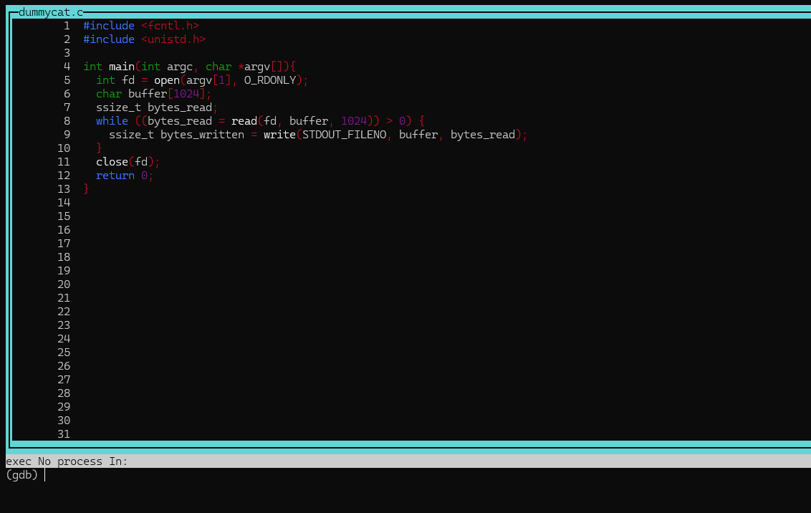
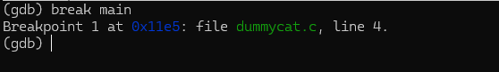
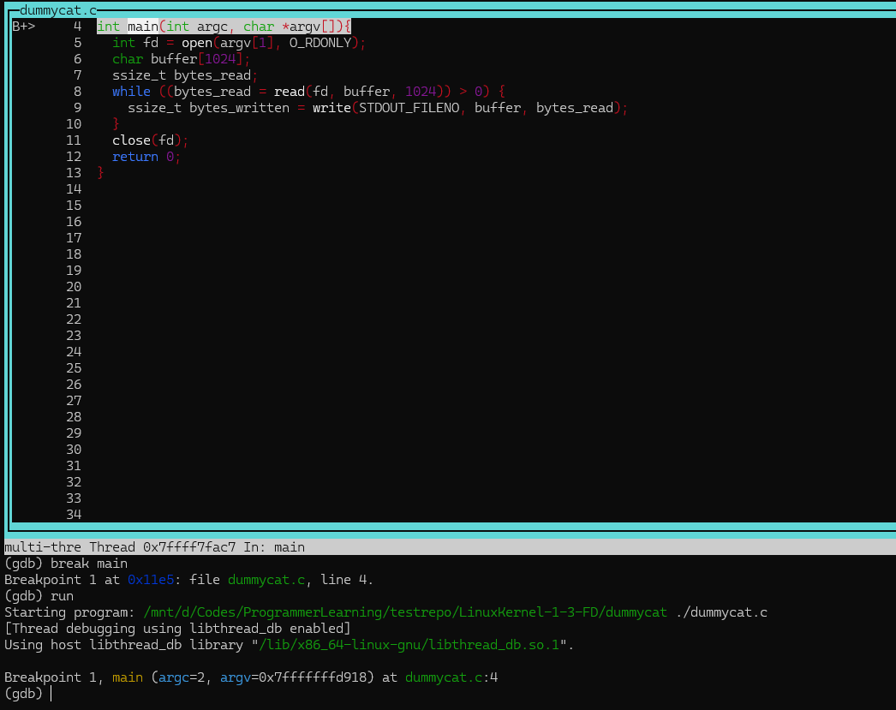
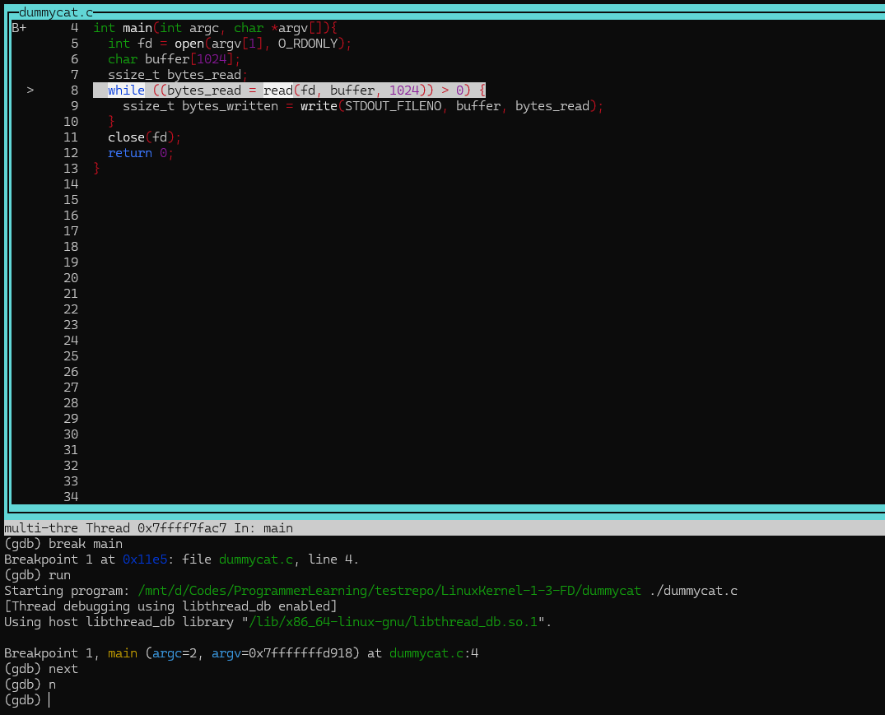
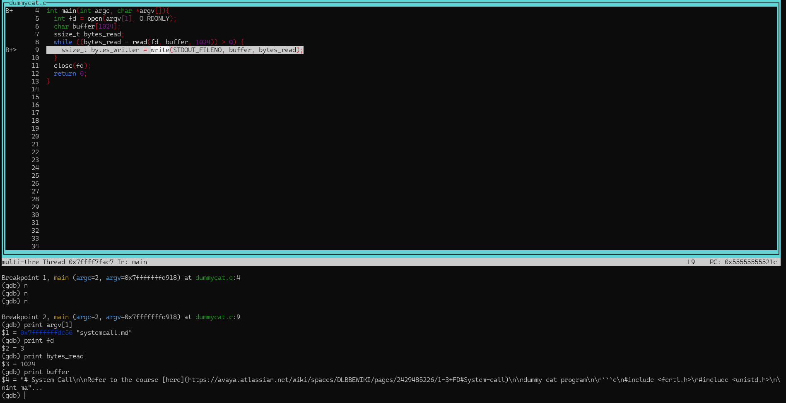
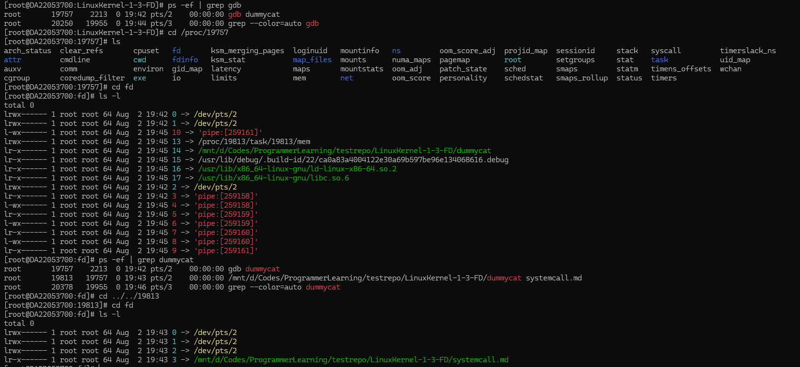
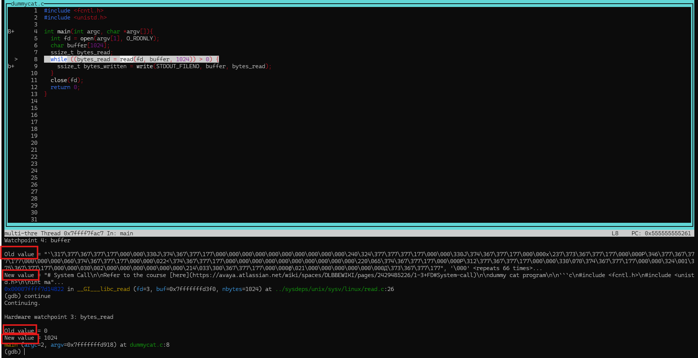

# System Call

Refer to the course [here](https://avaya.atlassian.net/wiki/spaces/DLBBEWIKI/pages/2429485226/1-3+FD#System-call)

dummy cat program

```c
#include <fcntl.h>
#include <unistd.h>

int main(int argc, char *argv[]){
  int fd = open(argv[1], O_RDONLY);
  char buffer[1024];
  ssize_t bytes_read;
  while ((bytes_read = read(fd, buffer, 1024)) > 0) {
    ssize_t bytes_written = write(STDOUT_FILENO, buffer, bytes_read);
  }
  close(fd);
  return 0;
}
```

compile and run
```
[root@DA22053700:LinuxKernel-1-3-FD]# vi dummycat.c
[root@DA22053700:LinuxKernel-1-3-FD]# gcc dummycat.c -o dummycat
[root@DA22053700:LinuxKernel-1-3-FD]# ls -l
total 28
-rwxrwxrwx 1 root root 16136 Aug  2 17:30 dummycat
-rwxrwxrwx 1 root root   308 Aug  2 17:29 dummycat.c
-rwxrwxrwx 1 root root  2998 Aug  2 17:26 fd.md
-rwxrwxrwx 1 root root  5001 Aug  2 08:57 task_struct.md
[root@DA22053700:LinuxKernel-1-3-FD]# ./dummycat dummycat.c
#include <fcntl.h>
#include <unistd.h>

int main(int argc, char *argv[]){
  int fd = open(argv[1], O_RDONLY);
  char buffer[1024];
  ssize_t bytes_read;
  while ((bytes_read = read(fd, buffer, 1024)) > 0) {
    ssize_t bytes_written = write(STDOUT_FILENO, buffer, bytes_read);
  }
  close(fd);
  return 0;
}
```

# debug the program

- Recompile with Debugging Symbols
```
gcc -g dummycat.c -o dummycat
```

- launch GDB
>\-\-agrs is used to pass parameters, otherwise, the second parameter is considered to be a core dump file (a crash log)
>```
>gdb --args dummycat ./dummycat.c
>```

- Enable Visual Mode
>Before you start running, turn on the visual source code layout. It splits the screen so you can see your code at the top and type commands at the bottom.
>

- Set a Breakpoint
>You need to tell GDB where to pause. The best place to start is the very beginning of your program (main).
>```
>(gdb) break main
>```
>
>(Shortcut: b main)
> To set breakpoint at a specific line, use "break <line>"
>[BreakAtLine9](screenshots/BreakAtLine9.png)

- Run the Program
>Start the program. It will immediately pause at the main function.
>```
>(gdb) run
>```
>

- Execute the next line
> This runs the current line of code and pauses at the very next line. It steps over functions (like printf or fopen), meaning it executes them in the background without dragging you into the system source code.
>```
>(gdb) next
>```
>

- Go inside a function: step
>If you are paused on a line that calls a function you wrote (e.g., process_file()), and you want to go inside it to debug it:
>```
>(gdb) step
>```

- Print a variable's value
>```
> (gdb) print my_variable
>```
>
> ***Discussion***: the varaiable ***fd*** is a handler pointing to the file opened. 
> I thought it was associated with the gdb process. However, I later figured out it was opened by my own program and confirmed the same.
> 

- Watch a variable automatically
>If you want GDB to alert you and pause every time a specific variable changes its value:
>```
>(gdb) watch my_variable
>```
> By Watching variables, the variable values are printed as program executes the steps.
>
> ***Note***: To avoid the outputs of the program from scrambling the screen, especially when source layout is used, we can redirect the standard output to /dev/null
>```
>(gdb) run ./systemcall.md > /dev/null
>```
> The fd associated with the program then changed accordingly
>```
>[root@DA22053700:fd]# ps -ef | grep dummycat
>root       22671    2213  0 20:05 pts/2    00:00:00 gdb dummycat
>root       22749   22671  0 20:06 pts/2    00:00:00 /mnt/d/Codes/ProgrammerLearning/testrepo/LinuxKernel-1-3-FD/dummycat systemcall.md
>[root@DA22053700:fd]# cd /proc
>[root@DA22053700:proc]# cd 22749
>[root@DA22053700:22749]# ls
>arch_status  clear_refs       cpuset   fd       ksm_merging_pages  loginuid   mountinfo   ns         oom_score_adj  projid_map  sessionid     stack   syscall         timerslack_ns
>attr         cmdline          cwd      fdinfo   ksm_stat           map_files  mounts      numa_maps  pagemap        root        setgroups     stat    task            uid_map
>auxv         comm             environ  gid_map  latency            maps       mountstats  oom_adj    patch_state    sched       smaps         statm   timens_offsets  wchan
>cgroup       coredump_filter  exe      io       limits             mem        net         oom_score  personality    schedstat   smaps_rollup  status  timers
>[root@DA22053700:22749]# cd fd
>[root@DA22053700:fd]# ls -l
>total 0
>lrwx------ 1 root root 64 Aug  2 20:06 0 -> /dev/pts/2
>l-wx------ 1 root root 64 Aug  2 20:06 1 -> /dev/null
>lrwx------ 1 root root 64 Aug  2 20:06 2 -> /dev/pts/2
>lr-x------ 1 root root 64 Aug  2 20:06 3 -> /mnt/d/Codes/ProgrammerLearning/testrepo/LinuxKernel-1-3-FD/systemcall.md
>```
